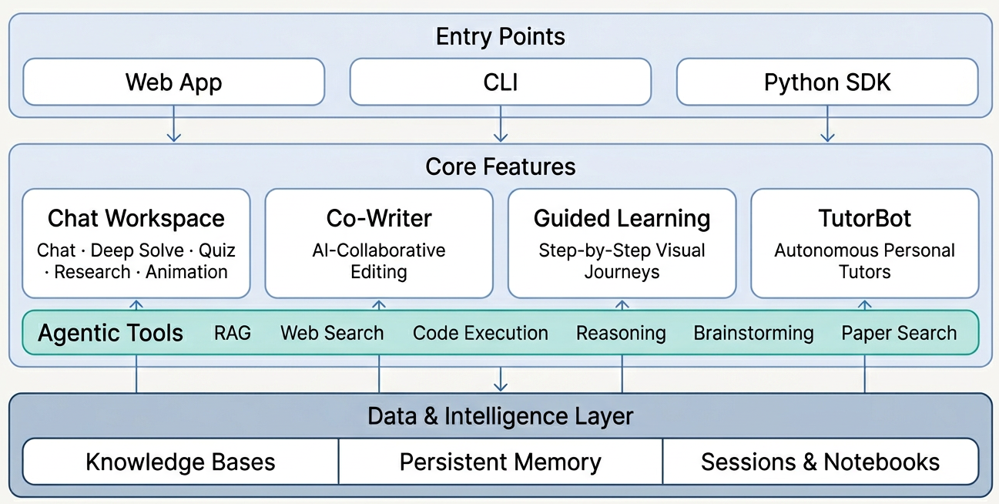
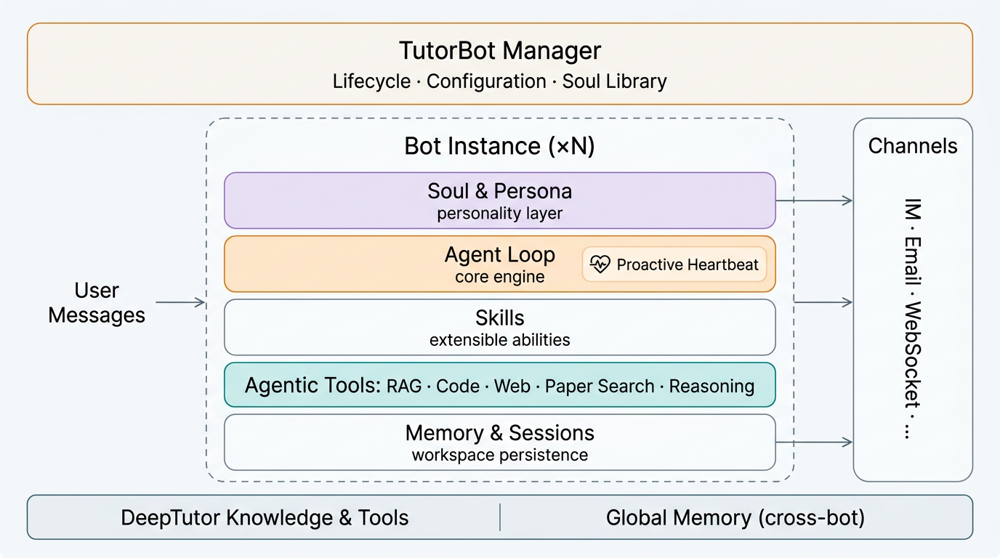

<div align="center">


# StudyPal: Agent-Native Personalized Tutoring


[](https://www.python.org/downloads/)
[](https://nextjs.org/)
[](LICENSE)
[](https://github.com/HKUDS/DeepTutor/releases)
[](#)


[Features](#-key-features) · [Get Started](#-get-started) · [Explore](#-explore-studypal) · [TutorBot](#-tutorbot--persistent-autonomous-ai-tutors) · [CLI](#%EF%B8%8F-studypal-cli--agent-native-interface) · [Community](#-community--ecosystem)


</div>

---


## ✨ Key Features

- **Unified Chat Workspace** — Six modes, one thread. Chat, Deep Solve, Quiz Generation, Deep Research, Math Animator, and Exam Simulator share the same context — start a conversation, escalate to multi-agent problem solving, generate quizzes, then deep-dive into research, all without losing a single message.
- **StudyPal Learning Workspace** — A rich student toolkit featuring adaptive study planners, Pomodoro focus sessions with ambient sounds, interactive whiteboard sketching, semantic concept mindmaps, slide deck generation, and interactive flashcard decks.
- **Personal TutorBots** — Not chatbots — autonomous tutors. Each TutorBot lives in its own workspace with its own memory, personality, and skill set. They support real-time voice sessions, set reminders, learn new abilities, and evolve as you grow. Powered by [nanobot](https://github.com/HKUDS/nanobot).
- **AI Co-Writer** — A Markdown editor where AI is a first-class collaborator. Select text, rewrite, expand, or summarize — drawing from your knowledge base and the web. Every piece feeds back into your learning ecosystem.
- **Guided Learning** — Turn your materials into structured, visual learning journeys. StudyPal designs multi-step plans, generates interactive pages for each knowledge point, and lets you discuss alongside each step.
- **Audio Overviews & Podcasts** — Generate conversational audio summaries and dual-host podcast discussions from learning material via Kokoro TTS.
- **Knowledge Hub** — Upload PDFs, Markdown, and text files to build RAG-ready knowledge bases. Organize insights across sessions in color-coded notebooks. Your documents don't just sit there — they actively power every conversation.
- **Persistent Memory** — StudyPal builds a living profile of you: what you've studied, how you learn, and where you're heading. Shared across all features and TutorBots, it gets sharper with every interaction.
- **Agent-Native CLI** — Every capability, knowledge base, session, and TutorBot is one command away. Rich terminal output for humans, structured JSON for AI agents and pipelines. Hand StudyPal a [`SKILL.md`](SKILL.md) and your agents can operate it autonomously.

---

## 🚀 Get Started

### Option A — Setup Tour (Recommended)

A **single interactive script** that walks you through everything: dependency installation, environment configuration, live connection testing, and launch. No manual `.env` editing needed.

```bash
git clone https://github.com/HKUDS/DeepTutor.git
cd DeepTutor

# Create a Python environment
conda create -n deeptutor python=3.11 && conda activate deeptutor
# Or: python -m venv .venv && source .venv/bin/activate

# Launch the guided tour
python scripts/start_tour.py
```

The tour asks how you'd like to use StudyPal:

- **Web mode** (recommended) — Picks a dependency profile, installs everything (pip + npm), then spins up a temporary server and opens the **Settings** page in your browser. A four-step guided tour walks you through LLM, Embedding, and Search provider setup with live connection testing. Once complete, StudyPal restarts automatically with your configuration.
- **CLI mode** — A fully interactive terminal flow: choose a dependency profile, install dependencies, configure providers, verify connections, and apply — all without leaving the shell.

Either way, you end up with a running StudyPal at [http://localhost:3782](http://localhost:3782).


> See [StudyPal CLI](#%EF%B8%8F-studypal-cli--agent-native-interface) for the full feature guide and command reference.

---

## 📖 Explore StudyPal

<div align="center">

</div>

### 💬 Chat — Unified Intelligent Workspace


Six distinct modes coexist in a single workspace, bound by a **unified context management system**. Conversation history, knowledge bases, and references persist across modes — switch between them freely within the same topic, whenever the moment calls for it.

| Mode | What It Does |
|:---|:---|
| **Chat** | Fluid, tool-augmented conversation. Choose from RAG retrieval, web search, code execution, deep reasoning, brainstorming, and paper search — mix and match as needed. |
| **Deep Solve** | Multi-agent problem solving: plan, investigate, solve, and verify — with precise source citations at every step. |
| **Quiz Generation** | Generate assessments grounded in your knowledge base, with built-in validation. |
| **Deep Research** | Decompose a topic into subtopics, dispatch parallel research agents across RAG, web, and academic papers, and produce a fully cited report. |
| **Math Animator** | Turn mathematical concepts into visual animations and storyboards powered by Manim. |
| **Exam Simulator** | Enforce a timed mock exam environment with mixed question types, auto-submit rules, and comprehensive rubric-based grading. |

Tools are **decoupled from workflows** — in every mode, you decide which tools to enable, how many to use, or whether to use any at all. The workflow orchestrates the reasoning; the tools are yours to compose.

> Start with a quick chat question, escalate to Deep Solve when it gets hard, generate quiz questions to test yourself, then launch a Deep Research to go deeper — all in one continuous thread.

### ✍️ Co-Writer — AI Inside Your Editor


Co-Writer brings the intelligence of Chat directly into a writing surface. It is a full-featured Markdown editor where AI is a first-class collaborator — not a sidebar, not an afterthought.

Select any text and choose **Rewrite**, **Expand**, or **Shorten** — optionally drawing context from your knowledge base or the web. The editing flow is non-destructive with full undo/redo, and every piece you write can be saved straight to your notebooks, feeding back into your learning ecosystem.

### 🎓 Guided Learning — Visual, Step-by-Step Mastery

Guided Learning turns your personal materials into structured, multi-step learning journeys. Provide a topic, optionally link notebook records, and StudyPal will:

1. **Design a learning plan** — Identify 3–5 progressive knowledge points from your materials.
2. **Generate interactive pages** — Each point becomes a rich visual HTML page with explanations, diagrams, and examples.
3. **Enable contextual Q&A** — Chat alongside each step for deeper exploration.
4. **Summarize your progress** — Upon completion, receive a learning summary of everything you've covered.

Sessions are persistent — pause, resume, or revisit any step at any time.

### 📚 Knowledge Management — Your Learning Infrastructure


Knowledge is where you build and manage the document collections that power everything else in StudyPal.

- **Knowledge Bases** — Upload PDF, TXT, or Markdown files to create searchable, RAG-ready collections. Add documents incrementally as your library grows.
- **Notebooks** — Organize learning records across sessions. Save insights from Chat, Guided Learning, Co-Writer, or Deep Research into categorized, color-coded notebooks.

Your knowledge base is not passive storage — it actively participates in every conversation, every research session, and every learning path you create.

### 🧠 Memory — StudyPal Learns As You Learn


StudyPal maintains a persistent, evolving understanding of you through two complementary dimensions:

- **Summary** — A running digest of your learning progress: what you've studied, which topics you've explored, and how your understanding has developed.
- **Profile** — Your learner identity: preferences, knowledge level, goals, and communication style — automatically refined through every interaction.

Memory is shared across all features and all your TutorBots. The more you use StudyPal, the more personalized and effective it becomes.

### 🛠️ StudyPal Toolkit — Visual & Audio Study Workspace

StudyPal provides a rich, interactive suite of visual and auditory learning tools, fully integrated with your personalized StudyPal memory and document context.

- **🎙️ Voice Assistant** — Speak directly to your TutorBot in real-time. Powered by Vocal Bridge, it features an immersive full-screen audio session UI, live streaming text transcript, low-latency audio response, and customizable voice agent profiles.
- **📅 Adaptive Study Planner** — Plan, organize, and track your learning progress using an interactive calendar driven by `@copilotkit` sidebar agents. Automatically schedules study blocks based on topics, and dynamically re-plans and re-balances remaining tasks when deadlines change or sessions are missed.
- **⏱️ Focus Mode & Ambient Sounds** — Cultivate deep work sessions with a distraction-free countdown timer (supporting Focus, Short Break, and Long Break presets) integrated with a minimal tasks panel and background ambient soundscapes (Lofi Study, Rain, Forest/Birds, White Noise) with custom volume adjustments.
- **🎨 Interactive Whiteboard** — Sketch, build diagrams, and visualize equations on an infinite digital canvas powered by an embedded draw.io iframe (controlled via postMessage API). Features a sidebar AI panel with tool capability toggles (RAG, Web Search) to auto-generate or refine diagrams, and supports graphing interactive GeoGebra curves.
- **🕸️ Semantic Mindmap** — Transform static notes and text uploads into interactive, responsive mindmap node graphs. Driven by `@copilotkit`, it lets you visually trace relationships between concepts and query the AI tutor to expand or restructure nodes on the fly.
- **🎧 Podcast Generator (Audio Overviews)** — Turn dense readings, notebooks, or custom topics into multi-turn conversational podcast scripts. Features a dual-host discussion between AI speakers Sarah and Alex, fully synthesized to high-quality audio files using a Kokoro TTS pipeline.
- **📊 Study Decks (Presenter)** — Programmatically convert research papers, notes, or learning topics into clean, structured PowerPoint presentations (`.pptx`). Generates outline slides, fills out bulleted key concepts, and packages it as a downloadable deck styled with StudyPal design templates.
- **🃏 Flashcards Workspace** — Generate self-study card decks from chat. Supports custom Q/A and Cloze deletions with built-in LaTeX math and code rendering. Students can flip cards with the spacebar and self-grade (Again or Knew it) to reinforce vocabulary and retention.
- **📝 Exam Simulator** — Test your readiness in a timed, strict-mode exam simulator. Generates a mix of Multiple Choice, Short Answer, and Long Answer questions grounded in specific documents or topics. Enforces a strict countdown with auto-submission, followed by a comprehensive AI grading review using customized rubrics.

---

### 🦞 TutorBot — Persistent, Autonomous AI Tutors

<div align="center">

</div>

TutorBot is not a chatbot — it is a **persistent, multi-instance agent** built on [nanobot](https://github.com/HKUDS/nanobot). Each TutorBot runs its own agent loop with independent workspace, memory, and personality. Create a Socratic math tutor, a patient writing coach, and a rigorous research advisor — all running simultaneously, each evolving with you.


- **Soul Templates** — Define your tutor's personality, tone, and teaching philosophy through editable Soul files. Choose from built-in archetypes (Socratic, encouraging, rigorous) or craft your own — the soul shapes every response.
- **Immersive Voice Sessions** — Speak directly to your TutorBot and listen to real-time replies. Includes a full-screen voice orb UI, low-latency audio response, and live scrolling transcript visualization powered by Vocal Bridge.
- **Independent Workspace** — Each bot has its own directory with separate memory, sessions, skills, and configuration — fully isolated yet able to access StudyPal's shared knowledge layer.
- **Proactive Heartbeat** — Bots don't just respond — they initiate. The built-in Heartbeat system enables recurring study check-ins, review reminders, and scheduled tasks. Your tutor shows up even when you don't.
- **Full Tool Access** — Every bot reaches into StudyPal's complete toolkit: RAG retrieval, code execution, web search, academic paper search, deep reasoning, and brainstorming.
- **Skill Learning** — Teach your bot new abilities by adding skill files to its workspace. As your needs evolve, so does your tutor's capability.
- **Multi-Channel Presence** — Connect bots to Telegram, Discord, Slack, Feishu, WeChat Work, DingTalk, Email, and more. Your tutor meets you wherever you are.
- **Team & Sub-Agents** — Spawn background sub-agents or orchestrate multi-agent teams within a single bot for complex, long-running tasks.

```bash
deeptutor bot create math-tutor --persona "Socratic math teacher who uses probing questions"
deeptutor bot create writing-coach --persona "Patient, detail-oriented writing mentor"
deeptutor bot list                  # See all your active tutors
```

---

### ⌨️ StudyPal CLI — Agent-Native Interface


StudyPal is fully CLI-native. Every capability, knowledge base, session, memory, and TutorBot is one command away — no browser required. The CLI serves both humans (with rich terminal rendering) and AI agents (with structured JSON output).

Hand the [`SKILL.md`](SKILL.md) at the project root to any tool-using agent ([nanobot](https://github.com/HKUDS/nanobot), or any LLM with tool access), and it can configure and operate StudyPal autonomously.

**One-shot execution** — Run any capability directly from the terminal:

```bash
deeptutor run chat "Explain the Fourier transform" -t rag --kb textbook
deeptutor run deep_solve "Prove that √2 is irrational" -t reason
deeptutor run deep_question "Linear algebra" --config num_questions=5
deeptutor run deep_research "Attention mechanisms in transformers"
```

**Interactive REPL** — A persistent chat session with live mode switching:

```bash
deeptutor chat --capability deep_solve --kb my-kb
# Inside the REPL: /cap, /tool, /kb, /history, /notebook, /config to switch on the fly
```

**Knowledge base lifecycle** — Build, query, and manage RAG-ready collections entirely from the terminal:

```bash
deeptutor kb create my-kb --doc textbook.pdf       # Create from document
deeptutor kb add my-kb --docs-dir ./papers/         # Add a folder of papers
deeptutor kb search my-kb "gradient descent"        # Search directly
deeptutor kb set-default my-kb                      # Set as default for all commands
```

**Dual output mode** — Rich rendering for humans, structured JSON for pipelines:

```bash
deeptutor run chat "Summarize chapter 3" -f rich    # Colored, formatted output
deeptutor run chat "Summarize chapter 3" -f json    # Line-delimited JSON events
```

**Session continuity** — Resume any conversation right where you left off:

```bash
deeptutor session list                              # List all sessions
deeptutor session open <id>                         # Resume in REPL
```

<details>
<summary><b>Full CLI command reference</b></summary>

**Top-level**

| Command | Description |
|:---|:---|
| `deeptutor run <capability> <message>` | Run any capability in a single turn (`chat`, `deep_solve`, `deep_question`, `deep_research`, `math_animator`) |
| `deeptutor chat` | Interactive REPL with optional `--capability`, `--tool`, `--kb`, `--language` |
| `deeptutor serve` | Start the StudyPal API server |

**`deeptutor bot`**

| Command | Description |
|:---|:---|
| `deeptutor bot list` | List all TutorBot instances |
| `deeptutor bot create <id>` | Create and start a new bot (`--name`, `--persona`, `--model`) |
| `deeptutor bot start <id>` | Start a bot |
| `deeptutor bot stop <id>` | Stop a bot |

**`deeptutor kb`**

| Command | Description |
|:---|:---|
| `deeptutor kb list` | List all knowledge bases |
| `deeptutor kb info <name>` | Show knowledge base details |
| `deeptutor kb create <name>` | Create from documents (`--doc`, `--docs-dir`) |
| `deeptutor kb add <name>` | Add documents incrementally |
| `deeptutor kb search <name> <query>` | Search a knowledge base |
| `deeptutor kb set-default <name>` | Set as default KB |
| `deeptutor kb delete <name>` | Delete a knowledge base (`--force`) |

**`deeptutor memory`**

| Command | Description |
|:---|:---|
| `deeptutor memory show [file]` | View memory (`summary`, `profile`, or `all`) |
| `deeptutor memory clear [file]` | Clear memory (`--force`) |

**`deeptutor session`**

| Command | Description |
|:---|:---|
| `deeptutor session list` | List sessions (`--limit`) |
| `deeptutor session show <id>` | View session messages |
| `deeptutor session open <id>` | Resume session in REPL |
| `deeptutor session rename <id>` | Rename a session (`--title`) |
| `deeptutor session delete <id>` | Delete a session |

**`deeptutor notebook`**

| Command | Description |
|:---|:---|
| `deeptutor notebook list` | List notebooks |
| `deeptutor notebook create <name>` | Create a notebook (`--description`) |
| `deeptutor notebook show <id>` | View notebook records |
| `deeptutor notebook add-md <id> <path>` | Import markdown as record |
| `deeptutor notebook replace-md <id> <rec> <path>` | Replace a markdown record |
| `deeptutor notebook remove-record <id> <rec>` | Remove a record |

**`deeptutor config` / `plugin` / `provider`**

| Command | Description |
|:---|:---|
| `deeptutor config show` | Print current configuration summary |
| `deeptutor plugin list` | List registered tools and capabilities |
| `deeptutor plugin info <name>` | Show tool or capability details |
| `deeptutor provider login <provider>` | Provider auth (`openai-codex` OAuth login; `github-copilot` validates an existing Copilot auth session) |

</details>

## 🗺️ Roadmap

| Status | Milestone |
|:---:|:---|
| 🔜 | **Authentication & Login** — Optional login page for public deployments with multi-user support |
| 🔜 | **Themes & Appearance** — Diverse theme options and customizable UI appearance |
| 🔜 | **LightRAG Integration** — Integrate [LightRAG](https://github.com/HKUDS/LightRAG) as an advanced knowledge base engine |
| 🔜 | **Documentation Site** — Comprehensive docs page with guides, API reference, and tutorials |

> If you find StudyPal useful, [give us a star](https://github.com/HKUDS/DeepTutor/stargazers) — it helps us keep going!

---

## 🌐 Community & Ecosystem

StudyPal stands on the shoulders of outstanding open-source projects:

| Project | Role in StudyPal |
|:---|:---|
| [**nanobot**](https://github.com/HKUDS/nanobot) | Ultra-lightweight agent engine powering TutorBot |
| [**LlamaIndex**](https://github.com/run-llama/llama_index) | RAG pipeline and document indexing backbone |
| [**ManimCat**](https://github.com/Wing900/ManimCat) | AI-driven math animation generation for Math Animator |

**From the HKUDS ecosystem:**

| [⚡ LightRAG](https://github.com/HKUDS/LightRAG) | [🤖 AutoAgent](https://github.com/HKUDS/AutoAgent) | [🔬 AI-Researcher](https://github.com/HKUDS/AI-Researcher) | [🧬 nanobot](https://github.com/HKUDS/nanobot) |
|:---:|:---:|:---:|:---:|
| Simple & Fast RAG | Zero-Code Agent Framework | Automated Research | Ultra-Lightweight AI Agent |


<div align="center">

Licensed under the [Apache License 2.0](LICENSE).

<p>
  
</p>

</div>
